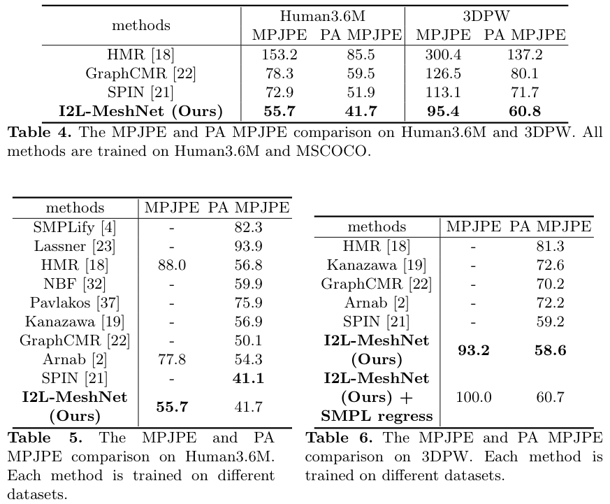
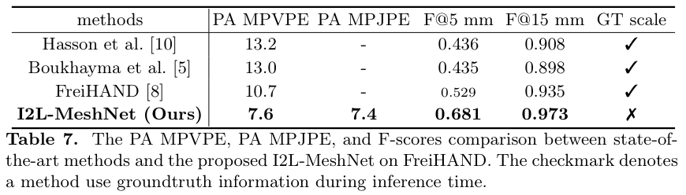

# I2L-MeshNet: Image-to-Lixel Prediction Network for Accurate 3D Human Pose and Mesh Estimation from a Single RGB Image  
  
<p align="center">  
  
</p> 

<p align="middle">

</p>

## News
There was a code mistake in [here](https://github.com/mks0601/I2L-MeshNet_RELEASE/blob/f7fe78e8e4b68cdc9da66f9c9d3a1b19af37b0fe/common/utils/transforms.py#L40). Basically, the translation during the rigid alignment was wrong. The results in my paper became better after I fix the error.

## Introduction  
This repo is official **[PyTorch](https://pytorch.org)** implementation of **[I2L-MeshNet: Image-to-Lixel Prediction Network for Accurate 3D Human Pose and Mesh Estimation from a Single RGB Image (ECCV 2020)](https://arxiv.org/abs/2008.03713)**. Our I2L-MeshNet wons the **first and second place** at [3DPW challenge](https://virtualhumans.mpi-inf.mpg.de/3DPW_Challenge/) on unknown assocation track in part orientation and joint position metrics, respectively.:tada:
  
  
## Quick demo  
* Install **[PyTorch](https://pytorch.org)** and Python >= 3.7.3 and run `sh requirements.sh`. You should slightly change `torchgeometry` kernel code following [here](https://github.com/mks0601/I2L-MeshNet_RELEASE/issues/6#issuecomment-675152527).
* Download the pre-trained I2L-MeshNet from [here](https://drive.google.com/file/d/14qAoFev6Rp_QY27f3cTztmIWTi7MVsnO/view?usp=sharing). This is not the [best accurate I2L-MeshNet](https://drive.google.com/file/d/1Ov6eYbBsgtmnrquo7l1plAT_gW7Gs0Ki/view?usp=sharing), but provides visually smooth meshes. [Here](https://github.com/mks0601/I2L-MeshNet_RELEASE#i2l-meshnet-for-mesh-visualization) is discussion about this.
* Prepare `input.jpg` and pre-trained snapshot at `demo` folder.
* Download `basicModel_f_lbs_10_207_0_v1.0.0.pkl` and `basicModel_m_lbs_10_207_0_v1.0.0.pkl` from [here](https://smpl.is.tue.mpg.de/) and `basicModel_neutral_lbs_10_207_0_v1.0.0.pkl` from [here](http://smplify.is.tue.mpg.de/). Place them at `common/utils/smplpytorch/smplpytorch/native/models`.
* Go to `demo` folder and edit `bbox` in [here](https://github.com/mks0601/I2L-MeshNet_RELEASE/blob/561fac8a74ae8bdc0429edc15e5dc4c47fda11bf/demo/demo.py#L83).
* run `python demo.py --gpu 0 --stage param --test_epoch 8` if you want to run on gpu 0.
* You can see `output_mesh_lixel.jpg`, `output_mesh_param.jpg`, `rendered_mesh_lixel.jpg`, `rendered_mesh_param.jpg`, `output_mesh_lixel.obj`, and `output_mesh_param.obj`. `*_lixel.*` are from lixel-based 1D heatmap of mesh vertices and `*_param.*` are from regressed SMPL parameters.
* If you run this code in ssh environment without display device, do follow:
```
1、Install oemesa follow https://pyrender.readthedocs.io/en/latest/install/
2、Reinstall the specific pyopengl fork: https://github.com/mmatl/pyopengl
3、Set opengl's backend to egl or osmesa via os.environ["PYOPENGL_PLATFORM"] = "egl"
```

## Directory  
### Root  
The `${ROOT}` is described as below.  
```  
${ROOT}  
|-- data  
|-- demo
|-- common  
|-- main  
|-- output  
```  
* `data` contains data loading codes and soft links to images and annotations directories.  
* `demo` contains demo codes.
* `common` contains kernel codes for I2L-MeshNet.  
* `main` contains high-level codes for training or testing the network.  
* `output` contains log, trained models, visualized outputs, and test result.  
  
### Data  
You need to follow directory structure of the `data` as below.  
```  
${ROOT}  
|-- data  
|   |-- Human36M  
|   |-- |-- rootnet_output  
|   |   |   |-- bbox_root_human36m_output.json  
|   |   |-- images  
|   |   |-- annotations   
|   |   |-- J_regressor_h36m_correct.npy
|   |-- MuCo  
|   |   |-- data  
|   |   |   |-- augmented_set  
|   |   |   |-- unaugmented_set  
|   |   |   |-- MuCo-3DHP.json
|   |   |   |-- smpl_param.json
|   |-- MSCOCO  
|   |   |-- rootnet_output  
|   |   |   |-- bbox_root_coco_output.json  
|   |   |-- images  
|   |   |   |-- train2017  
|   |   |   |-- val2017  
|   |   |-- annotations  
|   |   |-- J_regressor_coco_hip_smpl.npy
|   |-- PW3D
|   |   |-- rootnet_output  
|   |   |   |-- bbox_root_pw3d_output.json  
|   |   |-- data
|   |   |   |-- 3DPW_train.json
|   |   |   |-- 3DPW_validation.json
|   |   |   |-- 3DPW_test.json
|   |   |-- imageFiles
|   |-- FreiHAND
|   |   |-- rootnet_output  
|   |   |   |-- bbox_root_freihand_output.json  
|   |   |-- data
|   |   |   |-- training
|   |   |   |-- evaluation
|   |   |   |-- freihand_train_coco.json
|   |   |   |-- freihand_train_data.json
|   |   |   |-- freihand_eval_coco.json
|   |   |   |-- freihand_eval_data.json
```  
* Download Human3.6M parsed data and SMPL parameters [[data](https://drive.google.com/drive/folders/1r0B9I3XxIIW_jsXjYinDpL6NFcxTZart?usp=sharing)][[SMPL parameters from SMPLify-X](https://drive.google.com/drive/folders/12fCumEgs9PXT-dAaOGq0EDpl9dGKKorF?usp=sharing)]
* Download MuCo parsed/composited data and SMPL parameters [[data](https://drive.google.com/drive/folders/1dfhFa1kBHYKLTKuprNc7xixt3yyKEky5?usp=sharing)][[SMPL parameters from SMPLify-X](https://drive.google.com/drive/folders/1Wm1_6tn1u-_RE1iUlibIWfS75O79aJRz?usp=sharing)] 
* Download MS COCO SMPL parameters [[SMPL parameters from SMPLify-X](https://drive.google.com/drive/folders/1zLrbBaZzxsMx6QtDXqHm4JEuKNOez5dm?usp=sharing)]
* Download 3DPW parsed data [[data](https://drive.google.com/drive/folders/1HByTBsdg_A_o-d89qd55glTl44ya3dOs?usp=sharing)]
* Download FreiHAND parsed data [[data](https://drive.google.com/drive/folders/13qR8EhHFgvJ_AjgHz-JZKQQzYJX7oLpE?usp=sharing)]
* All annotation files follow [MS COCO format](http://cocodataset.org/#format-data).  
* If you want to add your own dataset, you have to convert it to [MS COCO format](http://cocodataset.org/#format-data).  
  
  
To download multiple files from Google drive without compressing them, try [this](https://chrome.google.com/webstore/detail/drive-multiple-downloader/baolodbihgboogdhkikimhadihambecp).
If you have a problem with 'Download limit' problem when tried to download dataset from google drive link, please try this trick.  
```  
* Go the shared folder, which contains files you want to copy to your drive  
* Select all the files you want to copy  
* In the upper right corner click on three vertical dots and select “make a copy”  
* Then, the file is copied to your personal google drive account. You can download it from your personal account.  
```  


### Pytorch SMPL and MANO layer
* For the SMPL layer, I used [smplpytorch](https://github.com/gulvarol/smplpytorch). The repo is already included in `common/utils/smplpytorch`.
* Download `basicModel_f_lbs_10_207_0_v1.0.0.pkl` and `basicModel_m_lbs_10_207_0_v1.0.0.pkl` from [here](https://smpl.is.tue.mpg.de/) and `basicModel_neutral_lbs_10_207_0_v1.0.0.pkl` from [here](http://smplify.is.tue.mpg.de/). Place them at `common/utils/smplpytorch/smplpytorch/native/models`.
* For the MANO layer, I used [manopth](https://github.com/hassony2/manopth). The repo is already included in `common/utils/manopth`.
* Download `MANO_RIGHT.pkl` from [here](https://mano.is.tue.mpg.de/) at `common/utils/manopth/mano/models`.
      
### Output  
You need to follow the directory structure of the `output` folder as below.  
```  
${ROOT}  
|-- output  
|   |-- log  
|   |-- model_dump  
|   |-- result  
|   |-- vis  
```  
* Creating `output` folder as soft link form is recommended instead of folder form because it would take large storage capacity.  
* `log` folder contains training log file.  
* `model_dump` folder contains saved checkpoints for each epoch.  
* `result` folder contains final estimation files generated in the testing stage.  
* `vis` folder contains visualized results.  


## Running I2L-MeshNet 
### Start  
* Install **[PyTorch](https://pytorch.org)** and Python >= 3.7.3 and run `sh requirements.sh`. You should slightly change `torchgeometry` kernel code following [here](https://github.com/mks0601/I2L-MeshNet_RELEASE/issues/6#issuecomment-675152527).
* In the `main/config.py`, you can change settings of the model including dataset to use, network backbone, and input size and so on.  
* There are two stages. 1) `lixel` and 2) `param`. In the `lixel` stage, I2L-MeshNet predicts lixel-based 1D heatmaps for each human joint and mesh vertex. In `param` stage, I2L-MeshNet predicts SMPL parameters from lixel-based 1D heatmaps.
  
### Train  
#### 1. lixel stage
First, you need to train I2L-MeshNet of `lixel` stage. In the `main` folder, run  
```bash  
python train.py --gpu 0-3 --stage lixel 
```  
to train I2L-MeshNet in the `lixel` stage on the GPU 0,1,2,3. `--gpu 0,1,2,3` can be used instead of `--gpu 0-3`. 

#### 2. param stage
Once you pre-trained I2L-MeshNet in `lixel` stage, you can resume training in `param` stage. In the `main` folder, run  
```bash  
python train.py --gpu 0-3 --stage param --continue
```  
to train I2L-MeshNet in the `param` stage on the GPU 0,1,2,3. `--gpu 0,1,2,3` can be used instead of `--gpu 0-3`.  
  
### Test  
Place trained model at the `output/model_dump/`.  Choose the stage you want to test among `lixel` and `param`.
  
In the `main` folder, run  
```bash  
python test.py --gpu 0-3 --stage $STAGE --test_epoch 20  
```  
to test I2L-MeshNet in `$STAGE` stage (should be one of `lixel` and `param`) on the GPU 0,1,2,3 with 20th epoch trained model. `--gpu 0,1,2,3` can be used instead of `--gpu 0-3`.  
  
## Results  
Here I report the performance of the I2L-MeshNet.  
<p align="center">

</p>

<p align="center">

</p>

#### Human3.6M dataset 
* Download I2L-MeshNet trained on [[Human3.6M+MSCOCO](https://drive.google.com/file/d/1c8zzKjnwMmErRDXlt8keVIS9Xoa7lG0c/view?usp=sharing)].
* Download bounding boxs and root joint coordinates (from [RootNet](https://github.com/mks0601/3DMPPE_ROOTNET_RELEASE)) of [[Human3.6M](https://drive.google.com/drive/folders/15qLaV3KdtPjpXljctlS2gcq4N-GVSDIc?usp=sharing)].
```
$ python test.py --gpu 4-7 --stage param --test_epoch 17
>>> Using GPU: 4,5,6,7
Stage: param
08-10 00:25:56 Creating dataset...
creating index...
index created!
Get bounding box and root from ../data/Human36M/rootnet_output/bbox_root_human36m_output.json
08-10 00:26:16 Load checkpoint from ../output/model_dump/snapshot_17.pth.tar
08-10 00:26:16 Creating graph...
100%|█████████████████████████████████████████████████████████████████████████████████████████████████████████████████████████████████████████████████████████████████████████████████████████████████████████| 35/35 [00:46<00:00,  1.09it/s]
MPJPE from lixel mesh: 55.83 mm
PA MPJPE from lixel mesh: 41.10 mm
MPJPE from param mesh: 66.05 mm
PA MPJPE from param mesh: 45.03 mm
```

#### 3DPW dataset
* Download I2L-MeshNet trained on [[Human3.6M+MuCo+MSCOCO](https://drive.google.com/file/d/1Ov6eYbBsgtmnrquo7l1plAT_gW7Gs0Ki/view?usp=sharing)].
* Download bounding boxs and root joint coordinates (from [RootNet](https://github.com/mks0601/3DMPPE_ROOTNET_RELEASE)) of [[3DPW](https://drive.google.com/file/d/1oqSllmOlapJFW7LqUEEyheqgnjP11Ol9/view?usp=sharing)].
```
$ python test.py --gpu 4-7 --stage param --test_epoch 7
>>> Using GPU: 4,5,6,7
Stage: param
08-09 20:47:19 Creating dataset...
loading annotations into memory...
Done (t=4.91s)
creating index...
index created!
Get bounding box and root from ../data/PW3D/rootnet_output/bbox_root_pw3d_output.json
08-09 20:47:27 Load checkpoint from ../output/model_dump/snapshot_7.pth.tar
08-09 20:47:27 Creating graph...
100%|███████████████████████████████████████████████████████████████████████████████████████████████████████████████████████████████████████████████████████████████████████████████████████████████████████| 555/555 [08:05<00:00,  1.06s/it]
MPJPE from lixel mesh: 93.15 mm
PA MPJPE from lixel mesh: 57.73 mm
MPJPE from param mesh: 100.04 mm
PA MPJPE from param mesh: 60.04 mm
```
#### MSCOCO dataset
The testing results on MSCOCO dataset are used for visualization (qualitative results).
* Download I2L-MeshNet trained on [[Human3.6M+MuCo+MSCOCO](https://drive.google.com/file/d/1Ov6eYbBsgtmnrquo7l1plAT_gW7Gs0Ki/view?usp=sharing)].
* Download bounding boxs and root joint coordinates (from [RootNet](https://github.com/mks0601/3DMPPE_ROOTNET_RELEASE)) [[MSCOCO](https://drive.google.com/file/d/1wEliu1l6YrXLYzwUIQUM8IYpevAFAeYf/view?usp=sharing)].
```
$ python test.py --gpu 4-7 --stage param --test_epoch 7
>>> Using GPU: 4,5,6,7
Stage: param
08-10 00:34:26 Creating dataset...
loading annotations into memory...
Done (t=0.35s)
creating index...
index created!
Load RootNet output from  ../data/MSCOCO/rootnet_output/bbox_root_coco_output.json
08-10 00:34:39 Load checkpoint from ../output/model_dump/snapshot_7.pth.tar
08-10 00:34:39 Creating graph...
100%|███████████████████████████████████████████████████████████████████████████████████████████████████████████████████████████████████████████████████████████████████████████████████████████████████████| 100/100 [01:31<00:00,  1.05it/s]
```
#### FreiHAND dataset
* Download I2L-MeshNet trained on [[FreiHand](https://drive.google.com/file/d/12NJRiIBG3RPqWHS93InlyGm3WSZrT8rX/view?usp=sharing)].
* Download bounding boxs and root joint coordinates (from [RootNet](https://github.com/mks0601/3DMPPE_ROOTNET_RELEASE)) of [[FreiHAND](https://drive.google.com/file/d/1LqKP3gFCDNC2epV-vsdwOZeR6_5sUZU2/view?usp=sharing)]. `bbox` is from [Detectron2](https://github.com/facebookresearch/detectron2).
 ```
$ python test.py --gpu 4-7 --stage lixel --test_epoch 24
>>> Using GPU: 4,5,6,7
Stage: lixel
08-09 21:31:30 Creating dataset...
loading annotations into memory...
Done (t=0.06s)
creating index...
index created!
Get bounding box and root from ../data/FreiHAND/rootnet_output/bbox_root_freihand_output.json
08-09 21:31:30 Load checkpoint from ../output/model_dump/snapshot_24.pth.tar
08-09 21:31:30 Creating graph...
100%|█████████████████████████████████████████████████████████████████████████████████████████████████████████████████████████████████████████████████████████████████████████████████████████████████████████| 62/62 [00:54<00:00,  1.12it/s]
Saved at ../output/result/pred.json
```
  
  #### I2L-MeshNet for mesh visualization
`loss['joint_orig']` and `loss['mesh_joint_orig']` in `main/model.py` makes the lixel-based meshes visually not smooth but 3D pose from meshes more accurate. This is because the loss functions are calculated from joint coordinates of each dataset, not from SMPL joint set. Thus, for the visually pleasant lixel-based meshes, disable the two loss functions when training.
* Download I2L-MeshNet trained on [[Human3.6M+MuCo+MSCOCO] without `loss['joint_orig']` and `loss['mesh_joint_orig']`](https://drive.google.com/file/d/1QuDfHYZSQpafCdi6Ibsh-U41nQvCPAcQ/view?usp=sharing).
* Below is the test result on 3DPW dataset. As the results show, it is worse than the above [best accurate I2L-MeshNet](https://github.com/mks0601/I2L-MeshNet_RELEASE#3dpw-dataset).

```
$ python test.py --gpu 4 --stage param --test_epoch 8
>>> Using GPU: 4
Stage: param
08-16 13:56:54 Creating dataset...
loading annotations into memory...
Done (t=7.05s)
creating index...
index created!
Get bounding box and root from ../data/PW3D/rootnet_output/bbox_root_pw3d_output.json
08-16 13:57:04 Load checkpoint from ../output/model_dump/snapshot_8.pth.tar
08-16 13:57:04 Creating graph...
100%|█████████████████████████████████████████████████████████████████████████████████████████████████████████████████████████████████████████████████████████████████████████████████████████████████████| 8879/8879 [17:42<00:00,  3.58it/s]
MPJPE from lixel mesh: 93.47 mm
PA MPJPE from lixel mesh: 60.87 mm
MPJPE from param mesh: 99.34 mm
PA MPJPE from param mesh: 61.80 mm
```

## Troubleshoots
* `RuntimeError: Subtraction, the '-' operator, with a bool tensor is not supported. If you are trying to invert a mask, use the '~' or 'logical_not()' operator instead.`: Go to [here](https://github.com/mks0601/I2L-MeshNet_RELEASE/issues/6#issuecomment-675152527)

## Reference  
```  
@InProceedings{Moon_2020_ECCV_I2L-MeshNet,  
author = {Moon, Gyeongsik and Lee, Kyoung Mu},  
title = {I2L-MeshNet: Image-to-Lixel Prediction Network for Accurate 3D Human Pose and Mesh Estimation from a Single RGB Image},  
booktitle = {European Conference on Computer Vision (ECCV)},  
year = {2020}  
}  
```


